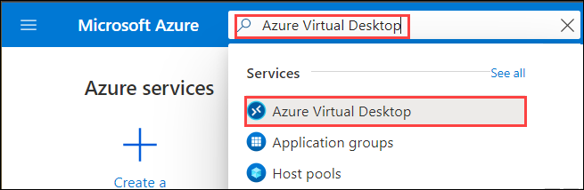
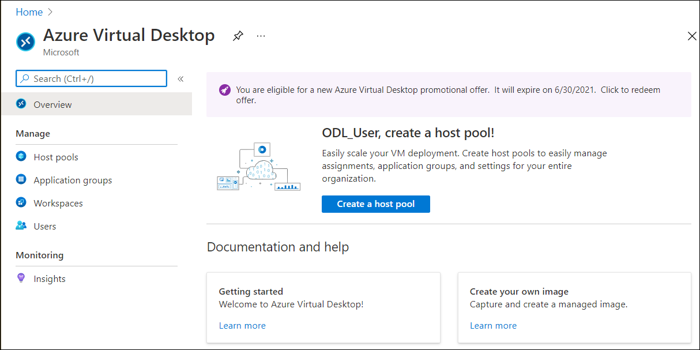
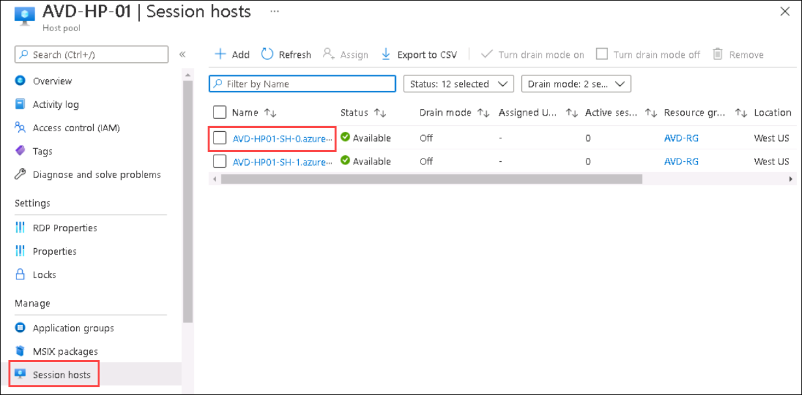
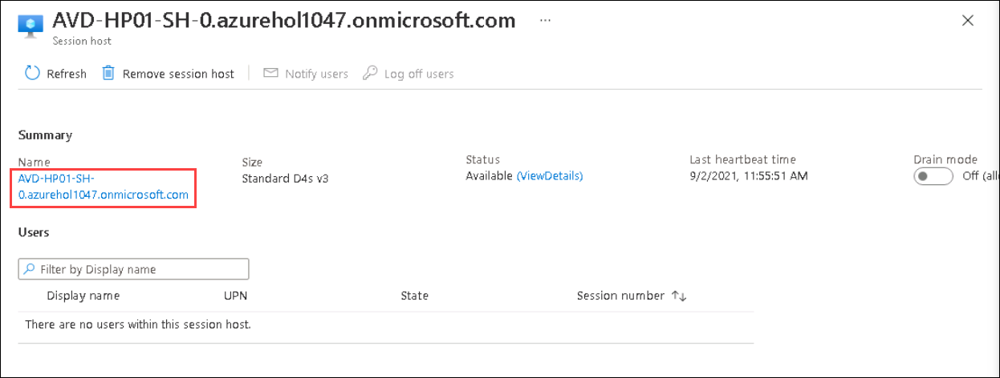
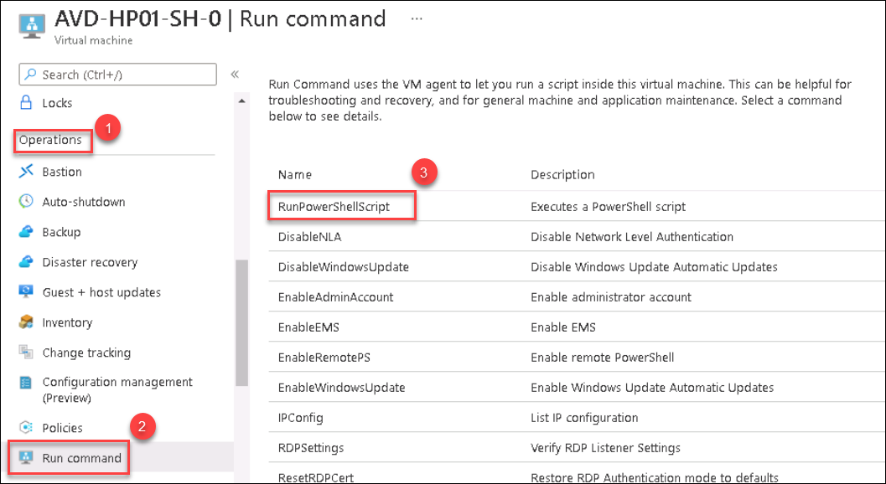

1. Navigate to Azure portal, then search for Azure Virtual Desktop in search bar and select Azure Virtual Desktop from the suggestions.

   

1. You will be directed towards the Azure Virtual Desktop management window.  

   
   
1. Click on the Session host tab and you will see two session hosts. Select **AVD-HP01-SH-0.azurehol1047.onmicrosoft.com** session host.

   
   
1. Click on **AVD-HP01-SH-0.azurehol1047.onmicrosoft.com**.

   
 
1. Under **Operations** blade, Select **Run Command**. Select **RunPowerShellScript**.

   
