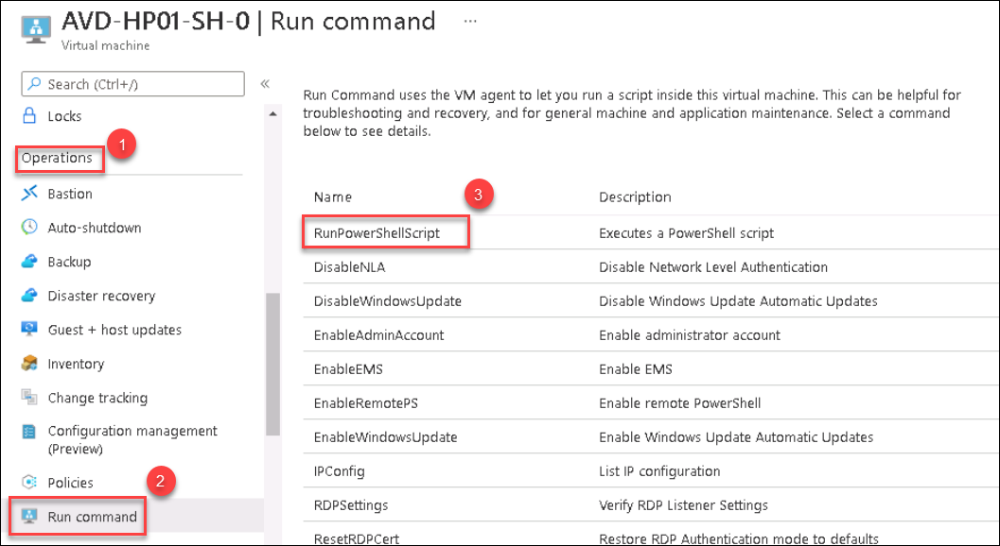
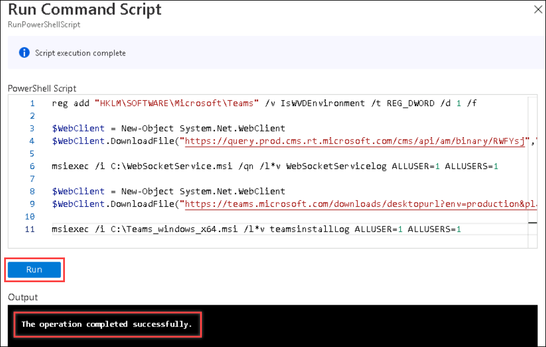

# Optional Lab: MS Teams Optimized Experience

1. Navigate to Azure portal, then search for Azure Virtual Desktop in search bar and select Azure Virtual Desktop from the suggestions.

   

1. You will be directed towards the Azure Virtual Desktop management window.  

   
   
1. Click on the Session host tab and you will see two session hosts. Select **AVD-HP01-SH-0.azurehol1047.onmicrosoft.com** session host.

   
   
1. Click on **AVD-HP01-SH-0.azurehol1047.onmicrosoft.com**.

   
 
1. Under **Operations** blade, Select **Run Command**. Select **RunPowerShellScript**.

   
   
1. Paste the following commands into the Powershell script window and select **Run**. Once the execution is completed, **The operation completed successfully** message wil be displayed in output window

   ```
   reg add "HKLM\SOFTWARE\Microsoft\Teams" /v IsWVDEnvironment /t REG_DWORD /d 1 /f

   $WebClient = New-Object System.Net.WebClient
   $WebClient.DownloadFile("https://query.prod.cms.rt.microsoft.com/cms/api/am/binary/RWFYsj","C:\WebSocketService.msi")
 
   msiexec /i C:\WebSocketService.msi /qn /l*v WebSocketServicelog ALLUSER=1 ALLUSERS=1

   $WebClient = New-Object System.Net.WebClient
   $WebClient.DownloadFile("https://teams.microsoft.com/downloads/desktopurl?env=production&plat=windows&arch=x64&managedInstaller=true&download=true","C:\Teams_windows_x64.msi")

   msiexec /i C:\Teams_windows_x64.msi /l*v teamsinstallLog ALLUSER=1 ALLUSERS=1
   
   Restart-Computer -Force
   
   ```

   

   >**NOTE**: Wait for 3 minutes as the Session VM will take time to restart.
